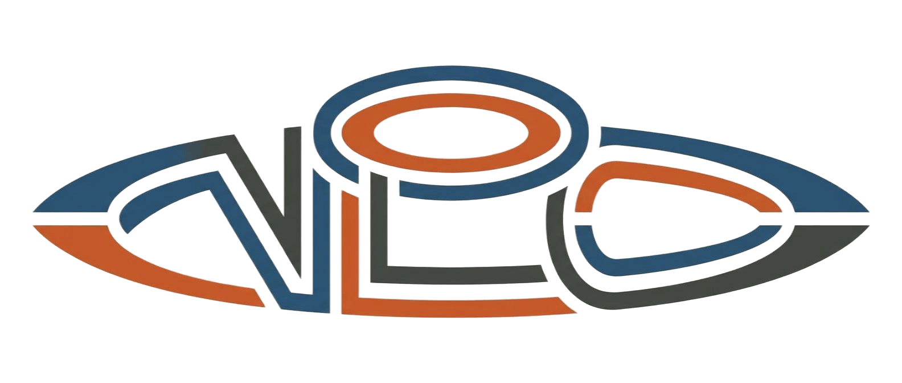

<p align="center">
  
</p>

<h1 align="center">NLO — a multilingual Jekyll theme</h1>

<p align="center">
  <em>A standalone fork of <a href="https://github.com/cotes2020/jekyll-theme-chirpy">Chirpy</a>,
  built for multilingual GitHub Pages blogs.</em>
</p>

<p align="center">
  <a href="https://github.com/GoXLd/NLO/blob/main/LICENSE"></a>
  
</p>

---

NLO is a self-maintained fork of `jekyll-theme-chirpy`. It keeps Chirpy's
clean writing-first layout and adds the features a real production blog ends
up needing — multiple languages, a GitHub contribution chart, brand logo,
and opt-in AdSense — all driven from `_config.yml` so the theme source stays
untouched.

The repository is meant for long-term customization instead of editing a
theme directly inside a production blog repo.

## Highlights

| Feature | What it does |
|---|---|
| 🌍 **Multilingual** | Comma-separated `lang:` renders a flag language switcher; posts are linked across languages by `translation_key`. |
| 📊 **GitHub chart** | Contribution graph blocks on the home page and sidebar. |
| 🖼️ **Branding logo** | Optional logo injected into the sidebar title. |
| 💸 **AdSense** | Optional, per-post ad script (only where you set `ads: true`). |
| 🌗 **Light / dark toggle** | Light by default, one-click dark mode from the sidebar. |
| 🤖 **dumalog-ready** | Fully supported as a publishing target for the [dumalog](https://github.com/GoXLd/dumalog) AI writing agent. |

## Quick start

```bash
bundle install
npm install        # frontend assets (Bootstrap, custom JS)
npm run build      # compile CSS + JS into assets/
bundle exec jekyll serve
```

Use the theme either as a **gem** (`theme: jekyll-theme-nlo`) or **vendored**
(copy the theme folders into your blog and drop the `theme:` key). Both modes
are supported; the footer version and cached asset paths resolve correctly in
each. See [`MIGRATION_CHECKLIST.md`](MIGRATION_CHECKLIST.md) for moving an
existing Chirpy blog over.

## Configuration

Everything theme-specific lives under the `nlo:` block in `_config.yml`:

```yml
# One language, or a comma-separated list to enable the switcher.
# The first entry is the default (its posts live at the site root).
lang: en, ru-RU, fr-FR

nlo:
  github_chart:
    enabled: false
    home_image: /assets/img/githubchart.svg
    sidebar_image: /assets/img/githubchart-sidebar.svg
  branding:
    logo_src:            # e.g. /assets/img/logo_nlo.png
    logo_alt:
    logo_aria_label:
  adsense:
    client:              # e.g. ca-pub-xxxxxxxxxxxxxxxx

# Leave empty to show the light/dark toggle (light is the default view).
# Set to `light` or `dark` to pin the site to one mode and hide the toggle.
theme_mode:
```

### Multilingual posts

Give every post a `language` and a shared `translation_key`. Translations live
under language subfolders and carry their own `permalink`:

```
_posts/2026-07-10-my-post.md              # language: en   (default)
_posts/ru/2026-07-10-my-post.md           # language: ru-RU
_posts/fr/2026-07-10-my-post.md           # language: fr-FR
```

```yml
---
title: My post
language: en
translation_key: my-post
---
```

Posts sharing a `translation_key` are cross-linked by the sidebar language
switcher.

## Integration with dumalog

NLO is a first-class publishing target for
[**dumalog**](https://github.com/GoXLd/dumalog), the AI agent that turns your
dev-chat history into blog posts. dumalog emits standard Jekyll posts with
front matter (`title`, `date`, `categories`, `tags`, `image`, …) — exactly
what NLO renders, including its `language` / `translation_key` multilingual
fields. Point dumalog at an NLO blog and generated posts publish with no
extra formatting step:

```bash
dumalog add-blog ~/Git/your-nlo-blog
dumalog write
```

## Version mechanism

The theme version shown in the footer comes from a single source of truth:

- **Gem installs** read `theme.version` from the gemspec.
- **Vendored installs** fall back to `_data/nlo.yml` (`version:`).

`tools/release.sh` keeps `package.json`, the gemspec, and `_data/nlo.yml` in
sync on every release, so the number in the footer always matches the shipped
version.

## Local visual editor

NLO bundles a customizable [`jekyll-admin`](https://github.com/jekyll/jekyll-admin)
fork for browser-based editing:

```bash
bash tools/run.sh --admin   # then open http://127.0.0.1:4000/admin
```

The `/admin` UI is served from the local `admin/` fork
(`admin/index.html`, `admin/nlo-admin.css`, `admin/nlo-admin.js`, mounted by
`_plugins/jekyll-admin-fork.rb`), so it can be themed without touching the
upstream gem.

## Translation matrix

Generate a machine-readable translation-status table (handy for AI translation
workflows):

```bash
ruby tools/generate-translation-matrix.rb
# → docs/translation-matrix.md, docs/translation-matrix.csv
```

## License

MIT — see [`LICENSE`](LICENSE) and [`NOTICE.md`](NOTICE.md).
