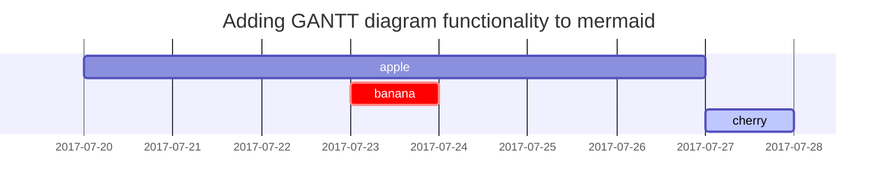

## Rubriques

<!-- markdownlint-capture -->
<!-- markdownlint-disable -->
# H1 — titre
{: .mt-4 .mb-0 }

## H2 — titre
{: data-toc-skip='' .mt-4 .mb-0 }

### H3 — titre
{: data-toc-skip='' .mt-4 .mb-0 }

#### H4 — titre
{: data-toc-skip='' .mt-4 }
<!-- markdownlint-restore -->

## Paragraphe

Quisque egestas convallis ipsum, ut sollicitudin risus tincidunt a. Maecenas interdum malesuada egestas. Duis consectetur porta risus, sit amet vulputate urna facilisis ac. Phasellus semper dui non purus ultrices sodales. Aliquam ante lorem, ornare a feugiat ac, finibus nec mauris. Vivamus ut tristique nisi. Sed vel leo vulputate, efficitur risus non, posuere mi. Nullam tincidunt bibendum rutrum. Proin commodo ornare sapien. Vivamus interdum diam sed sapien blandit, sit amet aliquam risus mattis. Nullam arcu turpis, mollis quis laoreet at, placerat id nibh. Suspendisse venenatis eros eros.

## Listes

### Liste ordonnée

1. Premièrement
2. Deuxièmement
3. Troisièmement

### Liste non ordonnée

- Chapitre
  - Section
    - Paragraphe

### Liste de tâches

- [ ] Emploi
  - [x] Étape 1
  - [x] Étape 2
  - [ ] Étape 3

### Liste descriptive

Soleil
: l'étoile autour de laquelle la Terre tourne

Lune
: le satellite naturel de la terre, visible par la lumière réfléchie du soleil

## Bloquer le devis

> Cette ligne montre le _block quote_.

## Invites

<!-- markdownlint-capture -->
<!-- markdownlint-disable -->
> Un exemple montrant l'invite de type `tip`.
{: .prompt-tip }

> Un exemple montrant l'invite de type `info`.
{: .prompt-info }

> Un exemple montrant l'invite de type `warning`.
{: .prompt-warning }

> Un exemple montrant l'invite de type `danger`.
{: .prompt-danger }
<!-- markdownlint-restore -->

## Tableaux

| Entreprise | Contact | Pays |
| :--------------------------- | :--------------- | ------: |
| Alfreds Futterkiste | Marie Anders | Allemagne |
| Commerce insulaire | Hélène Bennett | ROYAUME-UNI |
| Magazzini Alimentari Riuniti | Giovanni Rovelli | Italie |

## Links

<http://127.0.0.1:4000>

## Note de bas de page

Cliquez sur le crochet pour localiser la note de bas de page[^footnote], et voici une autre note de bas de page[^fn-nth-2].

## Code en ligne

Ceci est un exemple de `Inline Code`.

## Chemin du fichier

Voici le `/path/to/the/file.extend`{: .filepath}.

## Blocs de code

### Commun

```text
This is a common code snippet, without syntax highlight and line number.
```

### Langue spécifique

```bash
if [ $? -ne 0 ]; then
  echo "The command was not successful.";
  #do the needful / exit
fi;
```

### Nom de fichier spécifique

```sass
@import
  "colors/light-typography",
  "colors/dark-typography";
```
{: file='_sass/jekyll-theme-chirpy.scss'}

## Mathématiques

Les mathématiques propulsées par [**MathJax**](https://www.mathjax.org/) :

None
\begin{équation}
  \sum_{n=1}^\infty 1/n^2 = \frac{\pi^2}{6}
  \label{eq:série}
\fin{équation}
None

Nous pouvons référencer l’équation comme \eqref{eq:series}.

Lorsque $a \ne 0$, il existe deux solutions à $ax^2 + bx + c = 0$ et elles sont

$$ x = {-b \pm \sqrt{b^2-4ac} \over 2a} $$

## Sirène SVG



## Images

### Par défaut (avec légende)

{ : largeur="972" hauteur="589" }
_Largeur plein écran et alignement central_

### Aligné à gauche

{ : width="972" height="589" .w-75 .normal}

### Flotter vers la gauche

{ : width="972" height="589" .w-50 .left}
Praesent maximus aliquam sapien. Sed vel neque in dolor pulvinar auctor. Maecenas pharetra, sem sit amet interdum posuere, tellus lacus eleifend magna, ac lobortis felis ipsum id sapien. Proin ornare rutrum metus, ac convallis diam volutpat sit amet. Phasellus volutpat, elit sit amet tincidunt mollis, felis mi scelerisque mauris, ut facilisis leo magna accumsan sapien. In rutrum vehicula nisl eget tempor. Nullam maximus ullamcorper libero non maximus. Integer ultricies velit id convallis varius. Praesent eu nisl eu urna finibus ultrices id nec ex. Mauris ac mattis quam. Fusce aliquam est nec sapien bibendum, vitae malesuada ligula condimentum.

### Flottez vers la droite

{ : width="972" height="589" .w-50 .right}
Praesent maximus aliquam sapien. Sed vel neque in dolor pulvinar auctor. Maecenas pharetra, sem sit amet interdum posuere, tellus lacus eleifend magna, ac lobortis felis ipsum id sapien. Proin ornare rutrum metus, ac convallis diam volutpat sit amet. Phasellus volutpat, elit sit amet tincidunt mollis, felis mi scelerisque mauris, ut facilisis leo magna accumsan sapien. In rutrum vehicula nisl eget tempor. Nullam maximus ullamcorper libero non maximus. Integer ultricies velit id convallis varius. Praesent eu nisl eu urna finibus ultrices id nec ex. Mauris ac mattis quam. Fusce aliquam est nec sapien bibendum, vitae malesuada ligula condimentum.

### Mode sombre/clair et ombre

L'image ci-dessous basculera en mode sombre/clair en fonction des préférences de thème, remarquez qu'elle comporte des ombres.

{ : .light .w-75 .shadow .rounded-10 w='1212' h='668' }
{ : .dark .w-75 .shadow .rounded-10 w='1212' h='668' }

## Vidéo



## Note de bas de page inversée

[^footnote] : la source de la note de bas de page
[^fn-nth-2] : la deuxième source de note de bas de page
