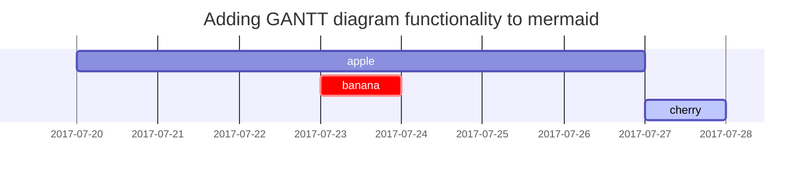

## Заголовки

<!-- markdownlint-capture -->
<!-- markdownlint-disable -->
# H1 — заголовок
{: .mt-4 .mb-0 }

## H2 — заголовок
{: data-toc-skip='' .mt-4 .mb-0 }

### H3 — заголовок
{: data-toc-skip='' .mt-4 .mb-0 }

#### H4 — заголовок
{: data-toc-skip='' .mt-4 }
<!-- markdownlint-restore -->

## Параграф

Quisque egestas convallis ipsum, ut sollicitudin risustincidunt a. Maecenas interdum Malesuada egestas. Duis consectetur porta risus, sit amet vulputate urna facilisis ac. Phasellus semper dui non purus ultrices sodales. Aliquam ante lorem, ornare a feugiat ac, finibus nec mauris. Vivamus ut tristique nisi. Sed vel leo vulputate, efficitur risus not, posuere mi. Нуллам тинцидунт бибендум рутрум. Proin commodo ornare sapien. Vivamus interdum diam sed sapien blandit, sit amet aliquam risus mattis. Nullam arcu turpis, mollis quis laoreet at, Placerat id nibh. Suspendisse venenatis eros eros.

## Списки

### Упорядоченный список

1. Во-первых
2. Во-вторых
3. В-третьих

### Неупорядоченный список

- Глава
  - Раздел
    - Параграф

### Список дел

- [ ] Работа
  - [x] Шаг 1
  - [x] Шаг 2
  - [ ] Шаг 3

### Список описаний

Солнце
: звезда, вокруг которой вращается Земля

Луна
: естественный спутник Земли, видимый в отраженном свете Солнца.

## Блокировать цитату

> Эта строка показывает _блочную цитату_.

## Подсказки

<!-- markdownlint-capture -->
<!-- markdownlint-disable -->
> Пример, показывающий приглашение типа `tip`.
{: .prompt-tip }

> Пример, показывающий приглашение типа `info`.
{: .prompt-info }

> Пример, показывающий приглашение типа `warning`.
{: .prompt-warning }

> Пример, показывающий приглашение типа `danger`.
{: .prompt-danger }
<!-- markdownlint-restore -->

## Таблицы

| Компания | Контакт | Страна |
| :--------------------------- | :--------------- | ------: |
| Альфредс Футтеркисте | Мария Андерс | Германия |
| Островная торговля | Хелен Беннетт | Великобритания |
| Магазин Алиментари Риунити | Джованни Ровелли | Италия |

## Ссылки

<http://127.0.0.1:4000>

## Сноска

Нажмите на крючок, чтобы найти сноску[^footnote], а вот еще одну сноску[^fn-nth-2].

## Встроенный код

Это пример `Inline Code`.

## Путь к файлу

Вот `/path/to/the/file.extend`{: .filepath}.

## Блоки кода

### Общий

```text
This is a common code snippet, without syntax highlight and line number.
```

### Конкретный язык

```bash
if [ $? -ne 0 ]; then
  echo "The command was not successful.";
  #do the needful / exit
fi;
```

### Конкретное имя файла

```sass
@import
  "colors/light-typography",
  "colors/dark-typography";
```
{: file='_sass/jekyll-theme-chirpy.scss'}

## Математика

Математика, основанная на [**MathJax**](https://www.mathjax.org/):

None
\begin{уравнение}
  \sum_{n=1}^\infty 1/n^2 = \frac{\pi^2}{6}
  \label{eq:series}
\end{уравнение}
None

Мы можем ссылаться на уравнение как \eqref{eq:series}.

Когда $a \ne 0$, существует два решения $ax^2 + bx + c = 0$:

$$ x = {-b \pm \sqrt{b^2-4ac} \over 2a} $$

## Русалка SVG



## Изображения

### По умолчанию (с подписью)

{: width="972" height="589" }
_Полная ширина экрана и выравнивание по центру_

### Выровнено по левому краю

{: width="972" height="589" .w-75 .normal}

### Плыть влево

{: width="972" height="589" .w-50 .left}
Praesent maximus aliquam sapien. Сед вел neque в горе pulvinar Auctor. Maecenas pharetra, sem sit amet interdum posuere, Tellus lacus eleifend magna, ac lobortis felis ipsum id sapien. Proin ornare rutrum metus, ac convallis diam volutpat sit amet. Phasellus volutpat, elit sit amettincidunt mollis, felis mi scelerisque mauris, ut facilisis leo magna accumsan sapien. In rutrum vehicula nisl eget tempor. Нуллам максимус улламкорпер либеро нон максимус. Целочисленные ultricies velit id convallis varius. Praesent eu nisl eu urna finibus ultrices id nec ex. Маурис ac mattis quam. Fusce aliquam est nec sapien bibendum, vitae Malesuada ligula condimentum.

### Плыть вправо

{: width="972" height="589" .w-50 .right}
Praesent maximus aliquam sapien. Сед вел neque в горе pulvinar Auctor. Maecenas pharetra, sem sit amet interdum posuere, Tellus lacus eleifend magna, ac lobortis felis ipsum id sapien. Proin ornare rutrum metus, ac convallis diam volutpat sit amet. Phasellus volutpat, elit sit amettincidunt mollis, felis mi scelerisque mauris, ut facilisis leo magna accumsan sapien. In rutrum vehicula nisl eget tempor. Нуллам максимус улламкорпер либеро нон максимус. Целочисленные ultricies velit id convallis varius. Praesent eu nisl eu urna finibus ultrices id nec ex. Маурис ac mattis quam. Fusce aliquam est nec sapien bibendum, vitae Malesuada ligula condimentum.

### Режим «Темный/Светлый» и «Тень»

Изображение ниже переключает темный/светлый режим в зависимости от предпочтений темы. Обратите внимание, что на нем есть тени.

{: .light .w-75 .shadow .rounded-10 w='1212' h='668' }
{: .dark .w-75 .shadow .rounded-10 w='1212' h='668' }

## Видео



## Обратная сноска

[^footnote]: источник сноски.
[^fn-nth-2]: второй источник сноски.
